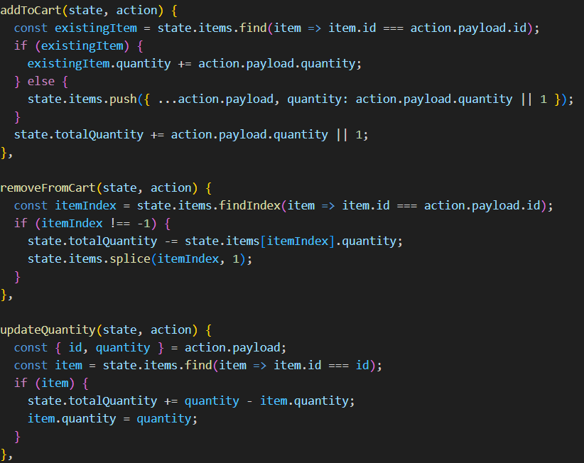
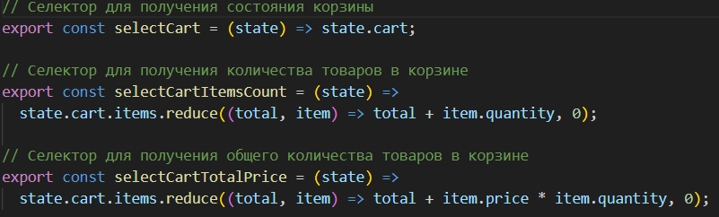
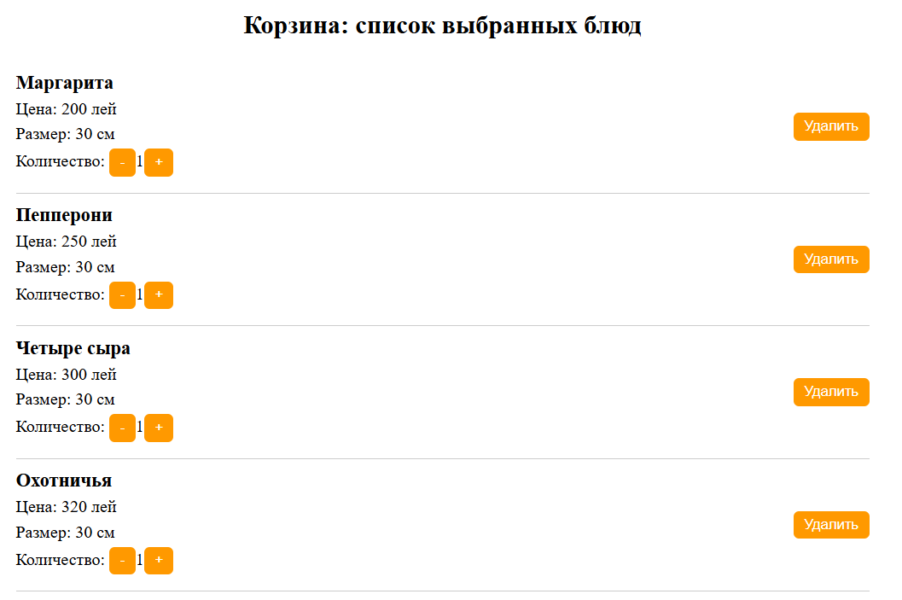
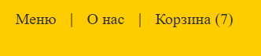

# Отчет по лабе 6

## Цель работы
Познакомиться с концепцией глобального состояния в React и научиться использовать Redux Toolkit для управления общими данными между компонентами. Научиться добавлять, изменять и удалять товары в корзине с использованием глобального хранилища.

### Описание лабораторной работы
Инструкции по запуску проекта
1. Установите зависимости: `npm install`.
2. Запустите проект: `npm run dev`.
3. Установка и настройка Redux Toolkit

```bash
npm install @reduxjs/toolkit react-redux
```


- store.js
1. Настроен Redux Store с использованием configureStore.
2. Подключен редюсер корзины (cartReducer) и RTK Query API (productsApi).
3. Реализованы функции для сохранения (saveState) и загрузки (loadState) состояния корзины в/из localStorage.
4. Добавлено предзагруженное состояние корзины (preloadedState).
5. Настроена подписка на изменения состояния Store для автоматического сохранения корзины.


- slice.js
1. Создан срез состояния корзины с начальными значениями (items, totalQuantity).
2. Реализованы действия:



 - addToCart — добавление товара в корзину.
 - removeFromCart — удаление товара из корзины.
 - updateQuantity — изменение количества товара в корзине.
3. Экспортированы действия и редюсер для использования в Store и компонентах.


- actions.js
1. Добавлены селекторы для работы с состоянием корзины:



 - selectCart — получение полного состояния корзины.
 - selectCartItemsCount — подсчет общего количества товаров в корзине.
 - selectCartTotalPrice — подсчет общей стоимости товаров в корзине.


- CartPage.jsx
1. Отображение списка товаров в корзине.
2. Реализованы функции:
 - Удаление товара из корзины (removeFromCart).
 - Изменение количества товара (updateQuantity).
3. Использованы селекторы для получения данных корзины.


- Header.jsx


1. Добавлено отображение общего количества товаров в корзине с использованием селектора selectCartItemsCount.
2. Реализована ссылка на страницу корзины.


### Примеры использования:


содержимое корзины



отображение кол-ва № товаров 


### Контрольные вопросы
1. Что такое глобальное состояние и зачем оно нужно?
Глобальное состояние — это единое хранилище данных, доступное для всех компонентов. Оно нужно для управления общими данными, такими как корзина или авторизация.

2. Что такое Redux Toolkit и как он упрощает работу с глобальным состоянием?
Redux Toolkit — это библиотека, упрощает настройку хранилища, предоставляя функции, такие как configureStore, которые автоматически добавляют middleware и упрощают интеграцию с RTK Query.

```js
import { configureStore } from '@reduxjs/toolkit';
import cartReducer from './cart/slice';

export const store = configureStore({
  reducer: {
    cart: cartReducer,
  },
```

3. Что такое слайсы и как они помогают организовать код?
Слайсы — это части состояния и логики, объединенные в одном месте. Они упрощают управление состоянием и делают код более структурированным. Например, действия addToCart, removeFromCart и updateQuantity находятся в одном файле, что упрощает их использование.

```js
const cartSlice = createSlice({
  name: 'cart',
  initialState: {
    items: [],
    totalQuantity: 0,
  },
  reducers: {
    addToCart(state, action) {
      const existingItem = state.items.find(item => item.id === action.payload.id);
      if (existingItem) {
        existingItem.quantity += action.payload.quantity;
      } else {
        state.items.push({ ...action.payload, quantity: 1 });
      }
      state.totalQuantity += action.payload.quantity || 1;
    },
```
